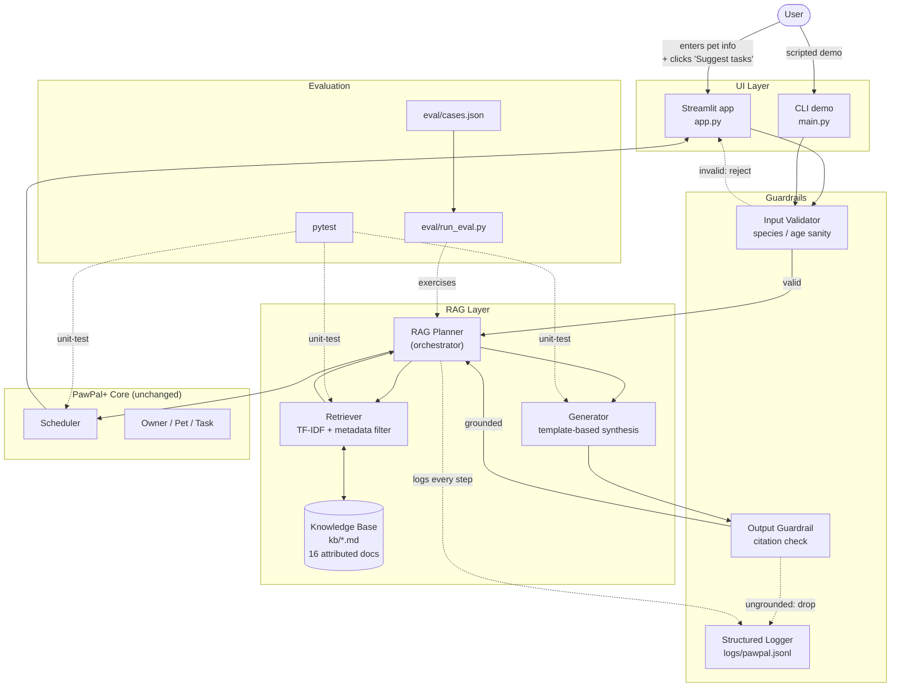

# PawPal+ AI — A Retrieval-Augmented Pet Care Planner

> _From task list to grounded care coach — PawPal+ now looks up real pet-care
> guidance before suggesting your pet's day._

PawPal+ AI is a small but complete applied-AI system. You enter your pet's
species and age, and the app proposes a full daily care plan (meals, walks,
play, grooming) where **every suggestion comes with a citation** to a real,
attributed pet-care document. You stay in control — nothing is added to your
schedule unless you click to accept it.

The whole system runs **offline** after a single `pip install`. There are no
API keys, no model downloads, and no usage costs.

---

## 📺 Demo Video

**YouTube walkthrough:** [](https://www.youtube.com/watch?v=X7pacCwOsVE)

---

## What This Project Is Extending

This project is built on top of an earlier mini-project called **PawPal+** —
the Module 2 "Show" project. The original PawPal+ was a Streamlit app for
managing pet care tasks: a user could create an owner, register pets, add
tasks (with date, time, duration, priority, frequency), generate a sorted
daily schedule, detect time conflicts, and find the next free slot. It was
fully manual — the user typed in every task themselves.

**PawPal+ AI is the same app with a new "brain" attached.** The original
scheduler logic is unchanged (all 21 of its tests still pass exactly as they
did before). What's new is a Retrieval-Augmented Generation (RAG) layer that
suggests a daily plan for any registered pet, drawing each suggested task
from a curated knowledge base of real pet-care guidance.

---

## What's New: The AI Feature

We added a **Retrieval-Augmented Generation (RAG)** pipeline. In plain words:

1. The app keeps a small library of pet-care notes on disk (`kb/`).
2. When you ask for suggestions, the app **looks up** which notes apply to
   your pet — based on species (dog / cat / rabbit) and life stage
   (puppy / kitten / adult / senior).
3. It then **builds a day plan** by reading structured fields out of those
   notes (each note carries one or more "task templates" with description,
   duration, frequency, time of day).
4. Every suggested task carries a **citation** back to the note it came
   from, including the source organization and a link.
5. Nothing is silently added to your schedule. You review the suggestions,
   check the ones you want, and click _Add selected to plan_.

Because the whole pipeline is deterministic, the same pet profile always
produces the same plan — easy to test, easy to trust.

---

## How It Works (Architecture Overview)

The system has six layers. Solid arrows are the normal user request flow;
dashed arrows are testing and logging paths.



A more detailed architecture document — including the request data flow,
component responsibilities, and conventions — lives in
[`assets/architecture.md`](assets/architecture.md).

### What each layer does

- **UI Layer** — the Streamlit web app for everyday use, plus a CLI demo
  script for quick reproducible runs.
- **Guardrails** — three reliability components in `src/guardrails.py`:
  - **Input validator** rejects unsupported species (no "hamster" or
    "iguana" support yet) and impossible ages before any work happens.
  - **Output guardrail** checks that every suggested task points to a real
    KB document. If it doesn't, the suggestion is dropped and logged.
  - **Structured logger** writes one JSON line per event to
    `logs/pawpal.jsonl` so we can audit what happened on any run.
- **RAG Layer** — the four pieces that make up the AI feature:
  - **Knowledge Base (`kb/`)** — 16 markdown documents, each one a short
    paraphrase of public pet-care guidance from a real organization
    (ASPCA, AVMA, AKC, Cornell Feline Health Center, Humane Society,
    House Rabbit Society). Each doc has TOML frontmatter with metadata
    and one or more task templates.
  - **Retriever** — uses scikit-learn TF-IDF over the KB. First filters
    docs by species and life stage, then ranks the matches by keyword
    similarity to any optional query.
  - **Generator** — fans each retrieved doc's task templates out into
    concrete suggestions, copying every field directly from the doc.
    No LLM, no hallucination risk — the generator literally cannot
    write a fact that wasn't already in the KB.
  - **RAG Planner** — the single seam between the new layer and the
    existing Core. Runs validation → retrieval → generation → guardrail
    in order and logs each step.
- **PawPal+ Core (unchanged)** — the original `Owner` / `Pet` / `Task` /
  `Scheduler` classes from the Module 2 project. AI-suggested tasks get
  converted into ordinary `Task` objects, so the scheduler's sorting,
  conflict detection, and recurrence logic apply to them just like to
  user-typed tasks.
- **Evaluation** — `eval/run_eval.py` runs 8 sample pet profiles end-to-end
  and asserts expected behaviors (e.g. "puppy walks must be ≤20 minutes",
  "rabbit plans must mention hay"). Plus 111 unit tests across all modules.

---

## Setup

**You only need Python 3.11 or newer and one `pip install`.** No accounts,
no API keys, no model downloads.

```bash
# 1. Clone the repo
git clone <repo-url>
cd applied-ai-system-rag-pet-care-planner

# 2. (Optional but recommended) create a virtual environment
python -m venv .venv
source .venv/bin/activate         # macOS / Linux
.venv\Scripts\activate            # Windows

# 3. Install dependencies (~30 MB total)
pip install -r requirements.txt
```

That's it. You can now run any of the three entry points below.

### Run the Streamlit web app

This is the main user experience.

```bash
streamlit run app.py
```

Open the URL it prints (usually `http://localhost:8501`). Walk through the
sections in order — create an owner, add a pet, then jump to **Section 4:
Suggest Tasks (AI)** to see the RAG layer in action.

### Run the CLI demo

A scripted end-to-end demo that's easy to read and screenshot.

```bash
python main.py
```

You'll see PawPal+ create a couple of pets, add some tasks, generate a
schedule, then run the RAG planner on a puppy and a senior cat and print
their grounded suggestions with citations.

### Run the evaluation harness

The reliability-and-evaluation entry point. Runs 8 cases, prints a per-case
pass/fail summary, exits with code 0 on full pass.

```bash
python eval/run_eval.py
```

### Run the test suite

```bash
pytest tests/ -v
```

Expected: **111 tests pass** across the original PawPal+ logic, the
retriever, the generator, the RAG planner, and the guardrails.

---

## Sample Interactions

Three examples below. The first two show the AI suggesting a daily plan;
the third shows the guardrail correctly refusing a request it can't
support.

### Example 1 — Puppy dog (Biscuit, age 0)

Input:

```python
pet = Pet(name="Biscuit", species="dog", age=0)
suggestions = suggest_tasks_for_pet(pet)
```

Output (8 grounded suggestions, sorted by time, with citations):

```
07:00  Puppy breakfast                      prio=high    conf=1.00  [dog_puppy_feeding]
08:30  Short structured walk                prio=high    conf=1.00  [dog_puppy_exercise]
11:00  Free play / sniffing time            prio=medium  conf=1.00  [dog_puppy_exercise]
12:00  Puppy lunch                          prio=high    conf=1.00  [dog_puppy_feeding]
17:30  Short structured walk                prio=medium  conf=1.00  [dog_puppy_exercise]
18:00  Puppy dinner                         prio=high    conf=1.00  [dog_puppy_feeding]
19:00  Gentle brushing & handling practice  prio=medium  conf=1.00  [dog_puppy_grooming]
21:00  Tooth brushing                       prio=medium  conf=1.00  [dog_puppy_grooming]
```

Notice that the walks are **15 minutes**, not 30 — the puppy KB doc
follows the standard "5 minutes per month of age" rule, and the system
respects it. Each suggestion's bracketed citation handle traces back to
a real KB doc with a source organization and URL.

### Example 2 — Senior cat (Smokey, age 12)

Input:

```python
pet = Pet(name="Smokey", species="cat", age=12)
suggestions = suggest_tasks_for_pet(pet)
```

Output (3 suggestions — the system is honest about its KB limits):

```
07:00  Breakfast (senior portion)          prio=high    conf=1.00  [cat_senior_feeding]
13:00  Midday snack                        prio=medium  conf=1.00  [cat_senior_feeding]
18:00  Dinner (senior portion)             prio=high    conf=1.00  [cat_senior_feeding]
```

Senior cats get **three smaller meals** instead of two large ones — this
is real domain knowledge captured in the KB. The system also doesn't
suggest anything outside what it actually knows about: the senior-cat
KB only covers feeding, so no play or grooming tasks are invented.

### Example 3 — Unsupported pet (Hammy the hamster)

Input:

```python
pet = Pet(name="Hammy", species="hamster", age=2)
suggestions = suggest_tasks_for_pet(pet)
```

Output:

```
[]
```

The input validator catches this before any retrieval happens. A
structured log entry is written:

```json
{
  "ts": "...",
  "event": "input.rejected",
  "stage": "pet_profile",
  "pet": "Hammy",
  "species": "hamster",
  "age": 2,
  "errors": [
    "species 'hamster' is not in the supported KB (['cat', 'dog', 'rabbit'])"
  ]
}
```

This is the system being **honest about what it doesn't know** rather
than making something up.

---

## Design Decisions

A few things were deliberate choices, not defaults:

### Why offline-first?

We could have used a hosted LLM (Anthropic, OpenAI) for the generation
step. We chose not to. Reasons:

- **No API keys to manage**, no per-call costs, no rate limits.
- **Anyone can clone and run in under a minute** — the `pip install` is
  ~30 MB and there are no model downloads.
- The eval harness is **deterministic** — the same KB always produces the
  same plan, so the tests don't get flaky.
- Citations are **mechanically guaranteed** — the template generator
  literally copies fields from the KB doc, so it cannot fabricate facts.

The trade-off is that the output is structured (a checklist with citations)
rather than flowing prose. For a planning tool we think that's actually
better — the user can act on it directly.

### Why TF-IDF instead of neural embeddings?

The KB is small (16 docs) and structured (every doc has explicit `species`
and `life_stage` fields). The metadata filter does most of the relevance
work — it shrinks the candidate set from 16 docs to typically 2–6 before
any keyword scoring happens. At that scale, TF-IDF with bigrams and
synonym tags performs as well as neural embeddings, and it runs in
milliseconds with no model file.

### Why TOML frontmatter?

The KB schema is structured (each doc has `task_templates` arrays).
Standard Markdown YAML frontmatter would have meant adding a `pyyaml`
dependency. We used TOML wrapped in `+++` delimiters because Python 3.11+
ships `tomllib` in the standard library — zero new dependencies.

### Why is the original PawPal+ Core untouched?

We added the entire RAG system as a new layer that hands its output back
to the existing classes as ordinary `Task` objects. This means:

- All 21 of the original PawPal+ tests still pass, exactly as they did
  before this project started.
- A future swap to a different generator (e.g. a local LLM) only needs
  to change `src/generator.py`. Everything else stays the same.
- AI-suggested tasks behave identically to user-typed tasks in the
  scheduler — sorting, conflict detection, and recurrence all work.

---

## Reliability and Testing

Three layers of confidence:

**1. Unit tests — `pytest tests/ -v`** — **111 passing** in under a second.

| Module                                                           | Tests |
| ---------------------------------------------------------------- | ----- |
| Original PawPal+ Core                                            | 21    |
| Retriever (load / filter / rank / synonyms / top-k)              | 18    |
| Generator (fan-out / citations / determinism / end-to-end)       | 14    |
| RAG Planner (life-stage / orchestration / conversion / pipeline) | 24    |
| Guardrails (validation / guardrail / confidence / logger)        | 34    |

**2. Evaluation harness — `python eval/run_eval.py`** — **35/35 checks
across 8 cases**, all green.

The harness asserts real domain knowledge:

- Puppy walks are **bounded by the 5-min-per-month rule** (≤20 min).
- Senior cats get **3+ feeding tasks** (smaller, more frequent meals).
- Rabbit plans must mention **hay** somewhere in the descriptions.
- Two edge cases (`hamster` species, `age=-1`) prove the **guardrails
  actually reject** bad input rather than making something up.

```
[PASS] puppy_dog                    7/7 checks (8 suggestion(s))
[PASS] adult_dog                    6/6 checks (8 suggestion(s))
[PASS] senior_dog                   5/5 checks (5 suggestion(s))
[PASS] adult_cat                    5/5 checks (4 suggestion(s))
[PASS] senior_cat                   4/4 checks (3 suggestion(s))
[PASS] adult_rabbit                 6/6 checks (7 suggestion(s))
[PASS] edge_unsupported_species     1/1 checks (0 suggestion(s))
[PASS] edge_invalid_age             1/1 checks (0 suggestion(s))

Total: 35/35 checks passed across 8 case(s) (8/8 cases fully green)
```

**3. Structured logging — `logs/pawpal.jsonl`.** Every retrieve, generate,
guard, and reject event is captured as a JSON line, so any past run can
be audited offline. The file is gitignored — it stays local.

**4. Human-in-the-loop checkpoint.** In the Streamlit UI, no AI-suggested
task is ever silently committed. The user reviews each suggestion (with
its citation visible) and explicitly checks the ones they want before
clicking _Add selected to plan_.

---

## Limitations and Honest Caveats

We tried to be clear about what this system **doesn't** do:

- **The KB is small.** 16 documents covering dogs, cats, and rabbits across
  basic life stages. Many real species (birds, fish, reptiles, small
  mammals beyond rabbits) are out of scope.
- **The KB is English-only and US-leaning.** The cited organizations are
  mostly North American. Other regions have equally valid (sometimes
  different) guidelines.
- **This is not veterinary advice.** Every doc paraphrases public guidance
  from real organizations, but the wording is summarized for a class
  project. Real care decisions need a real vet.
- **The output is structured, not conversational.** If you want the system
  to chat with you, this isn't that — it's a deterministic planner.
- **Age is in whole years.** A 6-month-old puppy is registered as `age=0`,
  same as an 11-month-old. The KB's puppy thresholds were chosen to be
  reasonable for both ends of that range, but a more granular age model
  (months) would be a clear next improvement.

These are documented further in [`model_card.md`](model_card.md).

---

## Reflection: What This Project Says About Me As An AI Engineer

This project was a chance to show how I actually think about building
applied-AI systems, not just how to wire one up.

The biggest signal is what I chose **not** to do. I had every option to
slot in a hosted LLM and have the project look more impressive at first
glance. I picked an offline, deterministic, citation-grounded design
instead — because for a planner that needs to be trusted, reliability
and reproducibility matter more than surface novelty. Every output here
can be traced back to a real document. That kind of constraint isn't
limiting; it's what makes the system safe to use.

I also stayed disciplined about scope. The original PawPal+ had 21
working tests, and I treated that as a contract — the new RAG layer was
added as a sibling, not a replacement, and all 21 of those original
tests still pass exactly as they did before. I think that habit (extending
without breaking what works) is one of the most important things an AI
engineer can practice, because real systems are almost never built from
scratch.

Finally, I planned the work in phases and verified each one before
moving on — architecture before code, retrieval before generation,
guardrails before evaluation, evaluation before documentation. That
order isn't accidental. It's how I keep a project honest with itself,
and it's how I'd expect to work on a real team.

If someone reading this wants a one-line takeaway: **I build AI systems
that are easy to verify, easy to run, and honest about their own
limits.**

---

## Project Structure

```
applied-ai-system-rag-pet-care-planner/
├── README.md                    ← you are here
├── app.py                       ← Streamlit entry point
├── main.py                      ← CLI demo entry point
├── requirements.txt             ← 4 packages, ~30 MB total
├── model_card.md                ← AI collaboration + bias reflection
├── assets/
│   └── architecture.md          ← Mermaid diagrams + design conventions
├── kb/                          ← 16 attributed pet-care docs (TOML frontmatter)
│   ├── README.md                ← KB schema + disclaimer
│   ├── dog_puppy_feeding.md
│   ├── dog_puppy_exercise.md
│   ├── ... (14 more)
│   └── rabbit_adult_enrichment.md
├── src/
│   ├── pawpal_system.py         ← original Owner/Pet/Task/Scheduler (unchanged)
│   ├── retriever.py             ← TF-IDF + metadata filter
│   ├── generator.py             ← template-based synthesis
│   ├── rag_planner.py           ← orchestrator (the seam)
│   └── guardrails.py            ← input/output validation + logger
├── tests/                       ← 111 pytest tests
│   ├── test_pawpal.py           ← 21 (original)
│   ├── test_retriever.py        ← 18
│   ├── test_generator.py        ← 14
│   ├── test_rag_planner.py      ← 24
│   └── test_guardrails.py       ← 34
├── eval/
│   ├── cases.json               ← 8 sample profiles + expected behaviors
│   └── run_eval.py              ← runner with check registry
├── images/                      ← screenshots
└── logs/                        ← gitignored; structured logger writes here
```

---

## Sources Cited By The Knowledge Base

The pet-care notes in `kb/` paraphrase publicly available guidance from
the following organizations. Each KB document attributes its source and
links to that organization's stable pet-care landing page:

- [ASPCA — Pet Care](https://www.aspca.org/pet-care)
- [AVMA — Resources for Pet Owners](https://www.avma.org/resources-tools/pet-owners)
- [AKC — Expert Advice](https://www.akc.org/expert-advice/)
- [Cornell Feline Health Center](https://www.vet.cornell.edu/departments-centers-and-institutes/cornell-feline-health-center)
- [The Humane Society — Resources](https://www.humanesociety.org/resources)
- [House Rabbit Society — Care](https://rabbit.org/care/)

Sources were paraphrased for educational use. **None of the content in
this repository should be treated as veterinary advice.** Consult a
licensed veterinarian for real care decisions about a real animal.
