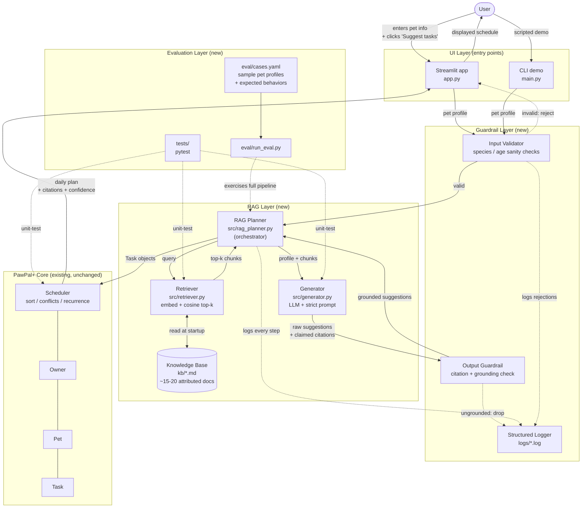
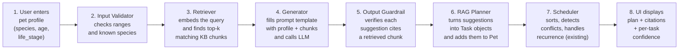

# PawPal+ AI — System Architecture

This document defines the architecture for the PawPal+ AI Retrieval-Augmented
Pet Care Planner, the applied-AI extension of the original PawPal+
mini-project. It is the spec the rest of the implementation phases build
against.

The base PawPal+ system (Owner / Pet / Task / Scheduler) is reused as-is.
Everything added on top of it forms the **RAG layer**, plus a
**guardrail layer** and an **evaluation layer** around the edges.

---

## 1. High-Level Component Diagram

How the parts of the system relate to each other. Solid arrows are the
main user-facing request path. Dashed arrows are testing / logging paths
that don't run during a normal user request.

---

## 2. Request Data Flow

What happens, step by step, when the user asks PawPal+ to suggest tasks
for a pet. This is the "happy path" — guardrail rejection and error paths
branch off but always end at the Logger.

---

## 3. Component Responsibilities

| Component | File | Phase | What it does | Why it's separate |
|---|---|---|---|---|
| **Streamlit UI** | `app.py` | reused (5) | Pet/task forms, "Suggest tasks" button, displays plan with citations. | Existing entry point; only needs to gain the new button. |
| **CLI demo** | `main.py` | reused (5) | Scripted end-to-end run — easier to demo and screenshot than the UI. | Useful for graders to reproduce results without clicking. |
| **Input Validator** | `src/guardrails.py` | 6 | Rejects unsupported species, nonsensical ages (e.g., 250-year-old cat). | Cheap pre-flight check — keeps bad inputs out of expensive LLM calls. |
| **Retriever** | `src/retriever.py` | 3 | Loads `kb/*.md`, embeds chunks once at startup, returns top-k by cosine similarity. | Pure search — no LLM. Independently testable; can be swapped for a vector DB later. |
| **Knowledge Base** | `kb/*.md` | 2 | ~15–20 attributed pet-care docs with frontmatter (`species`, `life_stage`, `topic`, `source`). | Data, not code — easy to audit and extend. |
| **Generator** | `src/generator.py` | 4 | Builds a strict prompt (profile + retrieved chunks), calls the LLM, parses structured output (suggestions + citations). | LLM logic isolated from retrieval — lets us mock the LLM in tests. |
| **RAG Planner** | `src/rag_planner.py` | 5 | Orchestrator: retrieve → generate → guardrail → convert to `Task` objects → hand off to Scheduler. | Single seam between the new RAG layer and the existing Core. |
| **Output Guardrail** | `src/guardrails.py` | 6 | Drops any suggestion whose claimed citation doesn't appear in the retrieved chunks. Computes a per-suggestion confidence score. | Prevents hallucinated tasks; satisfies the rubric's reliability requirement. |
| **Structured Logger** | `src/guardrails.py` | 6 | Writes JSON lines to `logs/` for every retrieve / generate / guard / reject event. | Required for the evaluation/observability story. |
| **PawPal+ Core** | `src/pawpal_system.py` | reused | Owner / Pet / Task / Scheduler — sorting, conflict detection, recurrence, slot finding. | Already tested (21 unit tests). RAG layer plugs into it; no changes needed. |
| **Eval Harness** | `eval/run_eval.py` | 7 | Runs 5–6 sample pet profiles end-to-end, checks each result against expected behaviors (e.g., "puppy plan must include short walks"). | Demonstrates the system meets its goals on a fixed test set. |
| **Unit Tests** | `tests/*.py` | 3, 4, 6 | Isolated tests per RAG component (retriever, generator with mocked LLM, guardrail). | Catches regressions during phase-by-phase development. |

---

## 4. Where Humans and Testing Fit

The rubric explicitly asks where humans and testing check the AI's
output. Three places:

1. **User confirmation in the UI (human-in-the-loop).**
   The Streamlit UI shows suggested tasks as a *preview* with citations
   visible. The user clicks "Add to plan" before any task becomes real.
   Nothing the LLM produces is silently committed to the schedule.

2. **Output guardrail (automated).**
   Every LLM suggestion must cite a chunk that actually came back from
   the retriever. Suggestions without a valid citation are dropped, not
   shown to the user, and logged as rejections. This catches the most
   common RAG failure mode: the LLM ignoring the retrieved context and
   answering from its own training data.

3. **Evaluation harness (automated, offline).**
   `eval/run_eval.py` runs the full pipeline against a fixed set of
   sample profiles and asserts expected behaviors per profile (e.g.,
   "the puppy profile's plan contains a short-walk task with duration
   ≤ 20 minutes"). Pass/fail counts are printed and reported in the
   README's testing summary.

---

## 5. Conventions and Constraints

These pin down decisions before coding so the implementation phases
don't have to negotiate them.

- **In-memory retrieval, no vector DB.** ~20 chunks fit comfortably in
  RAM; cosine over a NumPy matrix is enough. Adding a real vector DB
  would be ceremony for no benefit at this scale.
- **One LLM provider.** Anthropic's API via the `anthropic` SDK. The
  generator module is the only file that imports it, so swapping
  providers later is a one-file change.
- **Citations are required, not optional.** The generator's prompt
  insists on a `source_id` per suggestion, and the guardrail enforces
  it. No citation → suggestion dropped.
- **The original PawPal+ Core does not change.** All 21 existing tests
  must still pass after every phase. RAG output is converted into
  ordinary `Task` objects so the Scheduler treats AI-suggested tasks
  identically to user-entered ones.
- **Network access only inside the Generator.** The Retriever, KB,
  Guardrails, and Core are all offline. This makes 90% of the system
  testable without an API key.
- **The KB is the source of truth for pet-care guidance.** The LLM is
  only allowed to *summarize and adapt* what's in retrieved chunks for
  the specific pet — it must not invent guidelines.

---

## 6. What This Diagram Does *Not* Cover (Yet)

Deliberately deferred to keep the project scoped:

- Multi-turn conversation / chat history — the system is single-shot.
- Per-user accounts or persistence — runs in-memory per session.
- Real veterinary integration — KB is a curated demonstration set,
  not a clinical knowledge source. Stated plainly in the README.
- Adversarial prompt injection defense beyond the citation guardrail —
  noted as a limitation in the model card.
