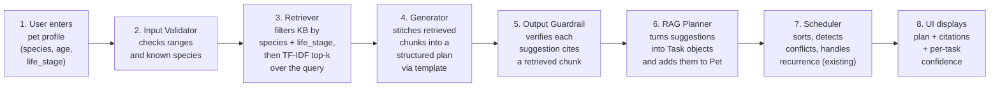

# PawPal+ AI — System Architecture

This document defines the architecture for the PawPal+ AI Retrieval-Augmented
Pet Care Planner, the applied-AI extension of the original PawPal+
mini-project. It is the spec the rest of the implementation phases build
against.

The base PawPal+ system (Owner / Pet / Task / Scheduler) is reused as-is.
Everything added on top of it forms the **RAG layer**, plus a
**guardrail layer** and an **evaluation layer** around the edges.

> **Design Revision (Phase 1.1) — offline-first stack.**
> An earlier draft of this architecture used the Anthropic API for the
> Generator and `sentence-transformers` for the Retriever. Both have been
> replaced with offline-first equivalents:
>
> - **Retriever:** scikit-learn TF-IDF over the KB, with metadata
>   pre-filtering on `species` and `life_stage` from each chunk's
>   frontmatter. No neural embeddings, no Hugging Face downloads.
> - **Generator:** deterministic template-based structured synthesis.
>   Retrieved chunks are stitched into a daily plan via a Python template
>   that mechanically guarantees every claim is grounded in a chunk.
>   No LLM, no API key, no inference latency.
>
> **Why:** the project must run immediately after `pip install` on a
> freshly cloned machine — no model downloads, no API keys, no usage
> costs. scikit-learn and numpy are already in the project's venv. With
> a small structured KB (~15–20 docs with explicit metadata), classical
> IR + metadata filtering is genuinely competitive with neural
> retrieval. The shape of the architecture (the layers, the citation
> guardrail, the eval harness) does not change — only the internals of
> the Retriever and Generator boxes.

---

## 1. High-Level Component Diagram

How the parts of the system relate to each other. Solid arrows are the
main user-facing request path. Dashed arrows are testing / logging paths
that don't run during a normal user request.

---

## 2. Request Data Flow

What happens, step by step, when the user asks PawPal+ to suggest tasks
for a pet. This is the "happy path" — guardrail rejection and error paths
branch off but always end at the Logger.

---

## 3. Component Responsibilities

| Component | File | Phase | What it does | Why it's separate |
|---|---|---|---|---|
| **Streamlit UI** | `app.py` | reused (5) | Pet/task forms, "Suggest tasks" button, displays plan with citations. | Existing entry point; only needs to gain the new button. |
| **CLI demo** | `main.py` | reused (5) | Scripted end-to-end run — easier to demo and screenshot than the UI. | Useful for graders to reproduce results without clicking. |
| **Input Validator** | `src/guardrails.py` | 6 | Rejects unsupported species, nonsensical ages (e.g., 250-year-old cat). | Cheap pre-flight check — keeps bad inputs out of the retrieval / synthesis pipeline. |
| **Retriever** | `src/retriever.py` | 3 | Loads `kb/*.md` once at startup, parses frontmatter, filters chunks by `species` + `life_stage`, then ranks the filtered set by TF-IDF cosine similarity over the query, returns top-k. | Pure search, fully offline (scikit-learn). Independently testable; the metadata filter can be swapped for vector search later without touching anything else. |
| **Knowledge Base** | `kb/*.md` | 2 | ~15–20 attributed pet-care docs with frontmatter (`species`, `life_stage`, `topic`, `tags`, `source`, `source_url`, `retrieved_on`). | Data, not code — easy to audit and extend. Frontmatter drives both the metadata filter and the citation system. |
| **Generator** | `src/generator.py` | 4 | Stitches retrieved chunks into a structured task plan via a Python template. Each generated task pulls its description, duration, frequency, and citation directly from a chunk's structured fields. No LLM, no external calls. | Template-based synthesis is fully deterministic, instantly testable, and *mechanically* incapable of producing an ungrounded claim. |
| **RAG Planner** | `src/rag_planner.py` | 5 | Orchestrator: retrieve → generate → guardrail → convert to `Task` objects → hand off to Scheduler. | Single seam between the new RAG layer and the existing Core. |
| **Output Guardrail** | `src/guardrails.py` | 6 | Drops any suggestion whose claimed `source_id` doesn't appear in the retrieved chunks. Computes a per-suggestion confidence score from retriever similarity + match strength. | Backstop in case the template logic ever changes; satisfies the rubric's reliability requirement explicitly. |
| **Structured Logger** | `src/guardrails.py` | 6 | Writes JSON lines to `logs/` for every retrieve / generate / guard / reject event. | Required for the evaluation/observability story. |
| **PawPal+ Core** | `src/pawpal_system.py` | reused | Owner / Pet / Task / Scheduler — sorting, conflict detection, recurrence, slot finding. | Already tested (21 unit tests). RAG layer plugs into it; no changes needed. |
| **Eval Harness** | `eval/run_eval.py` | 7 | Runs 5–6 sample pet profiles end-to-end, checks each result against expected behaviors (e.g., "puppy plan must include short walks"). Cases live in `eval/cases.json` (stdlib JSON, no extra deps). | Demonstrates the system meets its goals on a fixed test set. Determinism of Tier C makes assertions stable across runs. |
| **Unit Tests** | `tests/*.py` | 3, 4, 6 | Isolated tests per RAG component (retriever, generator, guardrail). | Catches regressions during phase-by-phase development. |

---

## 4. Where Humans and Testing Fit

The rubric explicitly asks where humans and testing check the AI's
output. Three places:

1. **User confirmation in the UI (human-in-the-loop).**
   The Streamlit UI shows suggested tasks as a *preview* with citations
   visible. The user clicks "Add to plan" before any task becomes real.
   Nothing the system produces is silently committed to the schedule.

2. **Output guardrail (automated).**
   Every generated suggestion must cite a `source_id` from a chunk that
   actually came back from the retriever. Suggestions with a missing
   or invalid citation are dropped, not shown to the user, and logged
   as rejections. With Tier C this is mostly a *backstop* — the
   template-based generator can't easily produce ungrounded output —
   but the guardrail still runs unconditionally, so any future swap to
   an LLM-based generator inherits the same protection automatically.

3. **Evaluation harness (automated, offline).**
   `eval/run_eval.py` runs the full pipeline against a fixed set of
   sample profiles and asserts expected behaviors per profile (e.g.,
   "the puppy profile's plan contains a short-walk task with duration
   ≤ 20 minutes"). Pass/fail counts are printed and reported in the
   README's testing summary. Because the pipeline is deterministic,
   these assertions are stable across runs.

---

## 5. Conventions and Constraints

These pin down decisions before coding so the implementation phases
don't have to negotiate them.

- **Offline-first, zero downloads, zero API keys.** The entire system
  must run after a single `pip install -r requirements.txt`. No
  Hugging Face model pulls, no Ollama, no hosted LLM, no auth tokens.
  This is a hard constraint: any future change that breaks it requires
  a documented design revision in this file.
- **In-memory retrieval, no vector DB.** ~20 chunks fit comfortably in
  RAM. scikit-learn's `TfidfVectorizer` builds the index at startup;
  cosine similarity is computed in NumPy. Adding a vector DB would be
  ceremony for no benefit at this scale.
- **Metadata filter before TF-IDF.** Each query carries `species` and
  `life_stage`; chunks not matching both are excluded *before* TF-IDF
  scoring. This shrinks the candidate set from ~20 to typically 4–6
  and is what makes classical IR competitive with neural retrieval on
  this KB.
- **No LLM in the request path.** The Generator is a deterministic
  Python template. Same pet profile + same KB → same plan, every
  time. This makes the eval harness assertions stable and removes a
  whole class of failure modes (hallucination, prompt injection,
  inference latency).
- **Citations are required, not optional.** Every generated task
  carries the `source_id` of the chunk it was synthesized from. The
  guardrail rejects any task whose citation doesn't appear in the
  retrieved set — a backstop in case the template ever changes.
- **The original PawPal+ Core does not change.** All 21 existing tests
  must still pass after every phase. RAG output is converted into
  ordinary `Task` objects so the Scheduler treats AI-suggested tasks
  identically to user-entered ones.
- **The KB is the only source of truth for pet-care guidance.** The
  Generator may select, adapt, and combine chunks for a specific pet,
  but it must not invent guidelines. Anything not in the KB simply
  isn't suggested.

---

## 6. What This Diagram Does *Not* Cover (Yet)

Deliberately deferred to keep the project scoped:

- Multi-turn conversation / chat history — the system is single-shot.
- Per-user accounts or persistence — runs in-memory per session.
- Real veterinary integration — KB is a curated demonstration set,
  not a clinical knowledge source. Stated plainly in the README.
- Natural-language paragraph output — the offline-first stack produces
  structured plans, not flowing prose. Noted as a deliberate trade-off
  in the model card. Swapping in a local or hosted LLM behind the
  Generator interface is a future enhancement, not a current goal.
- Cross-language / non-English KB content — out of scope for this
  curated demonstration set.
